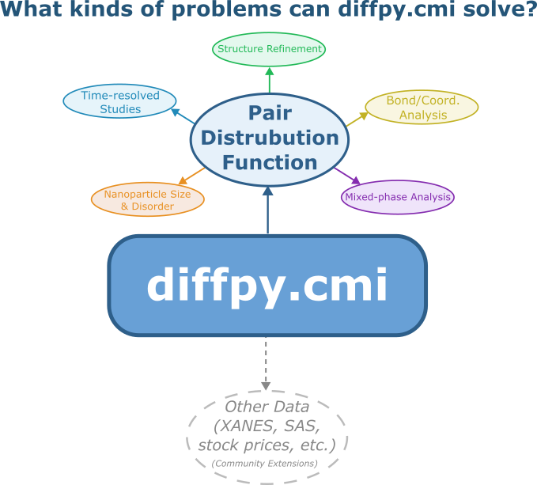

#######
|title|
#######

.. |title| replace:: diffpy.cmi documentation
| Software version |release|
| Last updated |today|.

``diffpy.cmi`` - Complex modeling infrastructure: a modular framework for multi-modal modeling of scientific data.

diffpy.cmi is designed as an extensible complex modeling infrastructure. Users and developers can readily integrate novel data types and constraints into custom workflows. While widely used for advanced analysis of structural data, the framework is general and can be applied to any problem where model parameters are refined to fit calculated quantities to data.

diffpy.cmi is a community-driven project that supports Unix, Linux, macOS, and Windows platforms. It is designed to be used in Python scripts enabling flexible scripting and automation for advanced and reproducible workflows. Users are encouraged to leverage the software for their modeling needs and to contribute feedback, use cases, and extensions through the project community.

.. image:: ./img/diffpycmi_screenshot.png
    :alt: codecov-in-pr-comment
    :width: 400px
    :align: center

=======================================
Community Use and Extensible Modeling
=======================================

One of the key strengths of ``diffpy.cmi`` is its modular design, which allows the integration and fitting of *any* data type, not just PDFs.
While its current core functionality is in PDF modeling and multi-dataset fitting, **we actively encourage and support community-developed modules and workflows for any data types you see fit!**

Have you built a new workflow you'd like to implement into ``diffpy.cmi``?
We would love to **highlight your extension or application!**

1. **Share your work:** Please `open an issue or a pull request <https://github.com/diffpy/diffpy.cmi>`_ to share your work and help us expand the platform.
2. **Be recognized:** Community contributions and new use cases will be showcased and credited here.

===============
Getting started
===============

To get started, please visit the :ref:`Getting started <getting-started>` page.

=======
Authors
=======

``diffpy.cmi`` is developed by Simon Billinge and members of the Billinge Group. The maintainer for this project is Simon Billinge. For a detailed list of contributors see
https://github.com/diffpy/diffpy.cmi/graphs/contributors.

============
Installation
============

See the `README <https://github.com/diffpy/diffpy.cmi#installation>`_
file included with the distribution.

================
Acknowledgements
================

``diffpy.cmi`` is built and maintained with `scikit-package <https://scikit-package.github.io/scikit-package/>`_.

=================
Table of contents
=================
.. toctree::
   :maxdepth: 2

   getting-started
   Tutorials <tutorials/index>
   Package API <api/diffpy.cmi>
   release
   license

=======
Indices
=======

* :ref:`genindex`
* :ref:`search`
