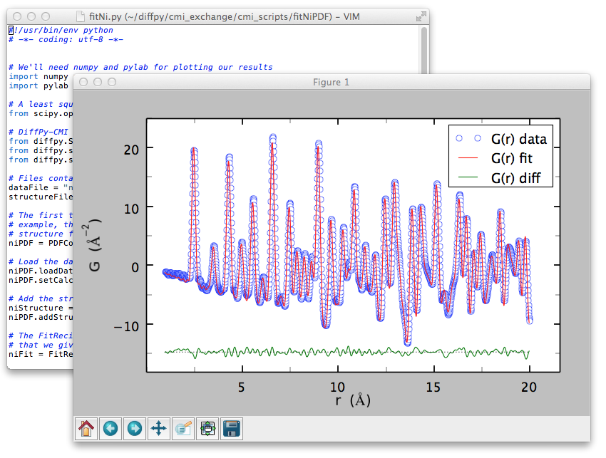
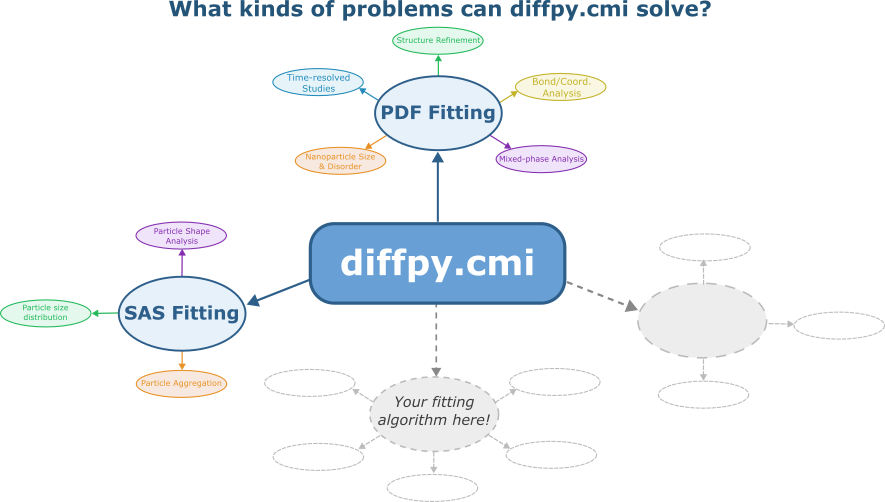

Overview
===========

``diffpy.cmi`` is designed as an extensible complex modeling infrastructure. Users and developers can readily integrate novel data types and constraints into custom workflows. While widely used for advanced analysis of structural data, the framework is general and can be applied to any problem where model parameters are refined to fit calculated quantities to data.

``diffpy.cmi`` is a community-driven project that supports Unix, Linux, macOS, and Windows platforms. It is designed to be used in Python scripts enabling flexible scripting and automation for advanced and reproducible workflows. Users are encouraged to leverage the software for their modeling needs and to contribute feedback, use cases, and extensions through the project community.

===========================
The power of diffpy.cmi
===========================

``diffpy.cmi`` is designed to be a **generalized regression engine** for any data type, enabling researchers to fit, analyze, and combine multiple sources of information in a unified framework.

.. raw:: html

    

        <strong>diffpy.cmi can be used to fit ANY type of data!</strong>
    

While its most commonly used functionality is in atomic pair distribution function (PDF) modeling and multi-dataset fitting,
**we actively encourage and support community-developed modules and workflows for any data types you see fit!**

To make ``diffpy.cmi`` easy to use and extend, we organize functionality into **Packs** and **Profiles**, allowing users to contribute their own modules and workflows seamlessly.

.. _whats-a-pack:

===============
What's a Pack?
===============

In short, a **pack** is a collection of Python packages that work together to accomplish a specific modeling task within the ``diffpy.cmi`` framework.
All packs rely on the pack called ``core``, which provides the essential building blocks for creating and running regression workflows.

For example, the ``pdf`` pack is designed to handle pair distribution function (PDF) modeling and analysis. It is comprised of two additional Python packages,
``diffpy.srreal`` and ``pyobjcryst``.

===========
Why Packs?
===========

``diffpy.cmi`` is designed to be a centeralized place for all regression tasks. If a user wants to use ``diffpy.cmi`` for one specific regression task
and not another, they can do so without having to install unnecessary packages. This design limits version conflicts between packages
that may arise if all packages were bundled together.

Overall, having a modular way to add new functionality is essential in keeping the codebase maintainable and user-friendly!

=========================
How to contribute a Pack
=========================

Have you built a new workflow you'd like to implement into ``diffpy.cmi``?
We would love to **highlight your extension or application!**
To share your work with the community, we ask you to follow these simple steps:

1. **Open an Issue:** Navigate to the ``diffpy.cmi`` `issues page <https://github.com/diffpy/diffpy.cmi/issues>`_ on GitHub and click :guilabel:`New Issue`.
   Select the "New Pack Proposal" template. Fill out the template with the required fields and open the issue.

.. image:: ./img/issue_template.png
    :alt: codecov-in-pr-comment
    :width: 500px
    :align: center

2. **Create a Pull Request:** Address all prompts and questions in the issue thread.
   Once all questions are answered and the pack is ready to be added to ``diffpy.cmi``,
   `create a pull request <https://github.com/diffpy/diffpy.cmi>`_  (PR) linking to the issue.
   The PR will be reviewed by the maintainers and merged once approved.
3. **Be recognized:** Community contributions and new use cases will be showcased and credited here.

===================
What's a Profile?
===================

A **profile** is a pre-configured modeling workflow for a specific data type or analysis task within the ``diffpy.cmi`` framework.
Profiles are designed to streamline the modeling process by providing users with ready-to-use configurations that can be easily
adapted to their specific needs. Profiles are designed to be simpler than packs, as they do not require any new code development.

For example, the profile ``all`` contains the ``plotting`` and ``pdf`` packs. Additionally, it contains the package ``ipykernel`` to enable Jupyter Notebook support.

===================
Why Profiles?
===================

Profiles are useful because they allow users to quickly set up and run modeling workflows without needing to configure each component individually.
Running a simple command ``cmi install <profile_name>`` will install all necessary packs and dependencies for that profile.

============================
How to contribute a Profile
============================

Have you built a new modeling workflow that you'd like to share with the community?
We would love to **highlight your extension or application!**
To share your work with the community, we ask you to follow these simple steps:

1. **Open an Issue:** Navigate to the ``diffpy.cmi`` `issues page <https://github.com/diffpy/diffpy.cmi/issues>`_ on GitHub and click :guilabel:`New Issue`.
   Select the "New Profile Proposal" template. Fill out the template with the required fields and open the issue.

.. image:: ./img/issue_template.png
    :alt: codecov-in-pr-comment
    :width: 500px
    :align: center

2. **Create a Pull Request:** Address all prompts and questions in the issue thread.
   Once all questions are answered and the profile is ready to be added to ``diffpy.cmi``,
   `create a pull request <https://github.com/diffpy/diffpy.cmi>`_  (PR) linking to the issue.
   The PR will be reviewed by the maintainers and merged once approved.
3. **Be recognized:** Community contributions and new use cases will be showcased and credited here.
